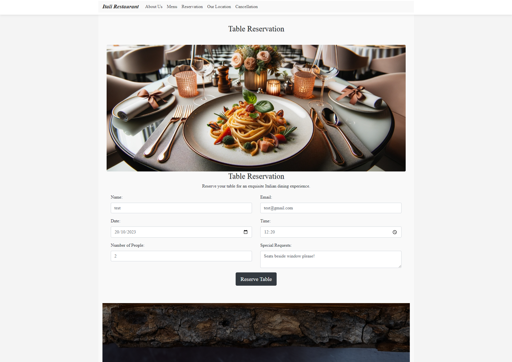
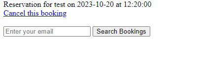

# Itali Restaurant Web Application

This repository contains the source code and documentation for the web application of "Itali Restaurant", an online website designed to understand the dynamics of restaurant table reservations, user interactions, and data handling for Italian cuisine.

## Introduction

The digitalisation of restaurants has become a pivotal aspect of modern dining experiences. This web application seeks to delve into this domain, offering functionalities that demonstrate the intricacies of web-based software for the hospitality industry, specifically tailored for Italian culinary establishments. The Table Reservation System serves as the centerpiece of this web application. This application provides a seamless experience for patrons who wish to secure a spot at their favorite Italian restaurant without any hassles.

## Features

- **Table Reservations**: Users can make, view, and modify their table reservations.
- **Cancellation**: Dynamic cancellation options integrated with real-time database updates.
- **Menu Viewer**: A detailed view of available Italian dishes, detailed descriptions, and pricing.
- **Contact**: Users have the capability to access contact information, observe social media symbols, view the establishment's location on a map, and peruse the 'About Us' section.

## Key Features of the Table Reservation System:

**To reserve a table**:
1. Head to our "Reservations" section on the navigation menu.
2. Fill out your details.
3. Select your preferred date, time, and number of guests.
4. Hit "Reserve Table" and you're all set!

**To cancel a reservation**:
1. Navigate to the "Cancellation" section on the navigation menu.
2. Enter the email address used during booking.
3. Select the booking you wish to cancel.

### Features Left to Implement

Waitlist System: If a desired reservation time is unavailable, offer users the ability to join a waitlist. They would be notified if a table becomes available.

Loyalty Programs: Implement a reward system where users earn points for each reservation, which can then be redeemed for discounts or free meals.

Integrated Payments: Allow users to pay for their meals in advance, especially useful for events or special dinners.

Feedback and Review System: Post-dining, users can leave feedback or reviews about their experience, helping the restaurant to continuously improve.

## Database Schema

The primary table, `reservations`, holds records of user reservations with fields such as `id`, `name`, `email`, `date`, `time`, `people`, and `requests`.

## Getting Started

### Prerequisites

Install XAMPP or WAMP based on your preference.
Basic understanding of PHP and MySQL.

### Installation

1. Get a copy of the repository:  
   `git clone https://github.com/Dulgisng/Restaurant_Reservation_Project_4`
2. Move to the downloaded project folder.
3. Launch `http://localhost/phpmyadmin` in your preferred web browser.
4. Initiate the database using the given structure.
   - Generate a new database named "reservations"
   - Import the provided sql file (`data.sql`) from the project.
5. Adjust the database connection configurations as needed.
6. Launch on either a local web server or an external hosting service.

### Output 

## Desktop Viewing 

- __Home Page__

- __About Us Section__

- __Menu Section__

- __Reservation Section__

- __Location & Map Section__

## Mobile Viewing

- __About Us Section__

- __Menu Section__

- __Reservation Section__

- __Location & Map Section__

## Testing

**Browser Compatibility:**  
This platform has been optimised to render consistently and operate seamlessly across a range of web browsers.

**Device Responsiveness:**  
The website's design is responsive, ensuring a smooth user experience across diverse devices, including:

- Desktops
- Tablets
- Mobile phones

**Manual Page Inspection:**  
Each page has been  examined to ensure its intended functionality.

**Operational Assurance:**  
All hyperlinks, interactive buttons, and form elements have been verified to be fully functional.

### Validator Testing 

No HTML errors were found when passing through the official [HTML Validator](https://validator.w3.org)

No CSS errors were found when passing through the official [CSS Validator](https://jigsaw.w3.org/css-validator)

### Unfixed Bugs

The website should work as intened with no unfixed bugs.

## Deployment

Create a new repository on GitHub by clicking on the "New" button on the main page.
Give repository a name and add a short description.
Initialize the repository with a README file by selecting the "Add a README file" checkbox.
Clone the repository to your local machine using Git.
Copy the code from my local machine to the cloned repository.
Add the files to the staging area using git add . command.
Commit the changes using git commit -m "Initial commit" command.
Push the changes to the GitHub repository using git push command.
Enable GitHub Pages in the repository settings.
Choose the main branch as the source for GitHub Pages.
Wait a few minutes for the changes to take effect.
